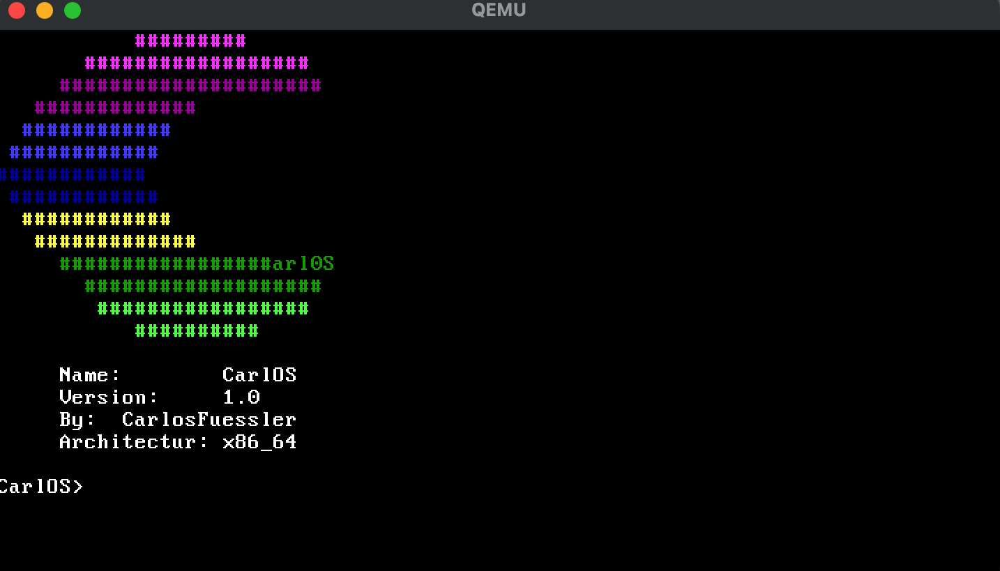

# CarlOS

A easy OS written in ASM and C

## Build-Instructions

```bash

#Build the Docker-Container
docker build build_env -t carl_os

#To run the VM
./run.sh

#If this dosent work ->

#Start Docker-Container
docker run --rm -it -v $(pwd):/root/env carl_os

# Build the Project
make build-x86_64

# And start it :-)
qemu-system-x86_64 -cdrom  -fda dist/x86_64/kernel.iso
```

## Projektstruktur

- `src/main/x86_64/boot/` - Boot-Assembly-Code
- `src/main/kernel/` - Kernel-C-Code
- `src/main/interface/` - Header-Dateien
- `targets/x86_64/` - Linker-Scripts und ISO-Konfiguration

#
## Features

- 32-bit to 64-bit Long Mode switch 
- VGA-Visuals
- Basic Printingfunctions
- String Conversion
- Shell prompting
- File-System



